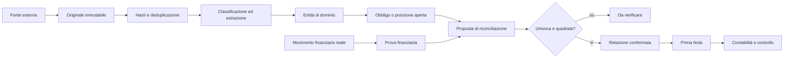

# Anatomia funzionale canonica

Questa cartella è la mappa autonoma di Impresa Semplice. Serve a progettare e verificare il nuovo gestionale senza dover consultare nuovamente sorgenti storiche e senza ricreare moduli concorrenti.

Il file machine-readable [`catalogo.json`](catalogo.json) è la fonte di verità per nodi e relazioni. [`topologia-flussi.json`](topologia-flussi.json) definisce il contratto evento→proprietario→entità→proiezione e [`TOPOLOGIA_FLUSSI.md`](TOPOLOGIA_FLUSSI.md) lo rende leggibile. Gli [`inventari`](inventari/README.md) conservano la ricognizione storica autosufficiente; [`INTEGRAZIONI_E_SICUREZZA.md`](INTEGRAZIONI_E_SICUREZZA.md) registra le decisioni sulle integrazioni esterne. La comparazione dei prezzi di acquisto rimane nel catalogo come capacità futura `ASSENTE` e verrà definita in un'attività separata.

La corrispondenza completa fra le 62 pagine censite nello snapshot e le destinazioni della nuova architettura è in [`MATRICE_PAGINE_STORICHE.md`](MATRICE_PAGINE_STORICHE.md).

## Fotografia di partenza

La ricognizione è stata eseguita il 13 agosto 2026 su uno snapshot storico immutabile, consultato esclusivamente in lettura, al commit `7f126c80522db6bd79f0eecaccfd643bae981793`.

Inventario verificato dello snapshot:

- 1.474 file tracciati;
- 76 componenti pagina frontend non di test;
- 62 pagine censite nel catalogo interno: 5 verificate, 14 in revisione e 43 non verificate;
- 161 moduli nell'area router e 114 registrazioni `include_router`;
- 1.108 endpoint runtime su 113 prefissi nella mappa rigenerata dalla CI;
- 202 costanti di collezione, corrispondenti a 196 nomi distinti;
- 174 modelli Pydantic o enum;
- 34 job schedulati;
- 50 schede descrittive di pagina e 36 schede popup;
- 381 file di test tra backend e frontend.

I numeri descrivono una superficie ampia, non una garanzia di completezza. Nello snapshot erano presenti più implementazioni dello stesso concetto: almeno quattro bilanci, due piani dei conti, due importatori di estratti conto, due pipeline PayPal, modelli assegni incompatibili, più store F24, fatture, dipendenti e cedolini, oltre a pipeline email e learning sovrapposte. Queste divergenze sono requisiti da consolidare, non codice da copiare.

La baseline del codice applicativo è il commit `fabf0fd52a0c0fc32e87e431943d5dbf8e910e8a`. Gli stati confrontano le capacità operative con quella baseline; la sola capacità `controllo.anatomia` usa come evidenza i documenti e i test introdotti dalla revisione corrente, prima del merge.

## Come leggere gli stati

| Stato | Significato vincolante |
|---|---|
| `PRESENTE` | Flusso collegato e coperto da test pertinenti nel codice verificato dalla revisione corrente. |
| `PARZIALE` | Esiste una parte reale del flusso, ma manca almeno un ingresso, collegamento, controllo o uso operativo. |
| `ASSENTE` | Nessuna implementazione equivalente utilizzabile nella baseline. |
| `DIVERGENTE` | Esiste qualcosa di simile, ma autorità del dato, schema o regola di dominio non sono compatibili. |
| `SUPERATO_DA_VERSIONE_PIU_RECENTE` | La funzione storica non va ricostruita perché la baseline contiene già una soluzione più sicura. |
| `ESCLUSO_DAL_PERIMETRO` | La funzione non appartiene a questo gestionale. |

Un file, una route o una schermata non bastano per passare a `PRESENTE`. Servono almeno: ingresso reale, persistenza canonica, deduplicazione, utilizzo operativo, gestione degli errori, provenienza e test. Ogni pagina `PRESENTE` o `PARZIALE` cita in `currentEvidence` esclusivamente file verificabili nel repository e nella revisione corrente; lo snapshot storico non vale come prova di implementazione corrente.

Lo stato di una sezione è sempre aggregato dalle sue pagine: è `PRESENTE` solo quando tutte sono presenti, `ASSENTE` solo quando tutte sono assenti e `PARZIALE` in ogni altro caso. Le evidenze appartengono alle pagine, non alla sezione.

## Albero di navigazione

Le sole sezioni principali restano sei. Le specializzazioni vivono sotto di esse; non diventano applicazioni parallele.

```text
Impresa Semplice
├── Home
│   ├── Quadro operativo
│   ├── Attività da completare
│   ├── Scadenze e priorità
│   └── Assistente e memoria operativa
├── Prima Nota
│   ├── Cassa
│   ├── Banca
│   ├── Carte e circuiti
│   ├── Salari
│   ├── Finanziamenti soci
│   ├── Provvisoria
│   ├── Corrispettivi e POS
│   └── Libro giornale e mastro
├── Documenti
│   ├── Acquisizione e inbox
│   ├── Archivio e viewer
│   ├── Indice e albero Drive
│   ├── Duplicati e piano cartelle
│   ├── Fatture fornitori e clienti
│   ├── Corrispettivi XML RT
│   ├── F24, quietanze e dichiarazioni
│   ├── Cedolini e riepiloghi paghe
│   ├── Estratti banca e carte
│   └── Riscossione, PagoPA e altri atti
├── Riconciliazione
│   ├── Coda generale e partite aperte
│   ├── Fatture e pagamenti
│   ├── F24 e riscossione
│   ├── Salari
│   ├── Carte, POS e accrediti
│   ├── Assegni
│   ├── PayPal e PagoPA
│   └── Verbali e audit di chiusura
├── Amministrazione
│   ├── Fornitori e soggetti
│   ├── Dizionario prodotti acquistati
│   ├── Dipendenti contabili minimi
│   ├── Fisco, IVA e codici tributo
│   ├── Riscossione e rateizzazioni
│   ├── Cespiti, finanziamenti e veicoli
│   ├── Commercialista e consulente
│   ├── Integrazioni e scheduler
│   ├── Utenti, ruoli e riconferma PIN
│   └── Configurazione agenti
└── Controllo
    ├── Coerenza e anomalie operative
    ├── Provenienza e grafo delle relazioni
    ├── Comparazione prezzi di acquisto
    ├── Controllo mensile e chiusura esercizio
    ├── Piano dei conti
    ├── Bilancio e IVA
    ├── Budget, previsioni e scadenze fiscali
    ├── Registro audit e rollback
    └── Stato importazioni e manutenzione Drive
```

## Proprietà funzionale

Ogni fatto ha un solo proprietario. Gli altri moduli lo consultano o vi collegano prove, ma non lo riscrivono.

| Proprietario | Autorità |
|---|---|
| `INTAKE_DOCUMENTALE` | Originale, hash, provenienza, classificazione ed estrazione. |
| `FATTURE_FORNITORI` | Fattura passiva, fornitore e componenti documentati da cui derivano debiti e scadenze. |
| `FATTURE_CLIENTI` | Fattura attiva, cliente e componenti documentati da cui derivano crediti e scadenze. |
| `CORRISPETTIVI_POS` | XML RT, chiusure operative, terminali e crediti verso gestori. |
| `PAGHE` | Cedolino, dipendente contabile, netto dovuto e anticipazioni F24. |
| `FISCO_F24` | Modello F24, righe, crediti, quietanza e attese fiscali. |
| `RISCOSSIONE` | Atto, rateizzazione e snapshot della situazione debitoria. |
| `TESORERIA` | Movimento banca/carta/cassa, assegno, payout e prova finanziaria. |
| `RICONCILIAZIONE` | Relazione e allocazione fra obbligo e prova finanziaria. |
| `PRIMA_NOTA` | Scrittura gestionale, conto, saldo e riporto. |
| `CONTABILITA` | Piano dei conti, giornale, mastro, IVA, bilancio e chiusura. |
| `CONTROLLO` | Anomalia, quadratura, approvazione e audit. |
| `AMMINISTRAZIONE` | Anagrafiche condivise e materializzazione degli obblighi dalle fonti di dominio, senza inventarne importi. |
| `SICUREZZA` | Identità, sessione, ruolo, riconferma PIN e autorizzazioni. |
| `ASSISTENTE` | Memoria derivata, proposta e spiegazione; mai fatto economico autorevole. |

## Catena dei dati



Regole non negoziabili:

1. documento, disposizione, quietanza e movimento finanziario restano prove diverse;
2. importo uguale non identifica la stessa operazione;
3. un collegamento automatico richiede chiavi stabili, compatibilità temporale e quadratura esatta;
4. una relazione è un record autonomo, non un campo che sovrascrive le due entità collegate;
5. ogni trasformazione conserva fonte, versione, hash, istante, regola e confidenza;
6. un caso ambiguo resta `DA_VERIFICARE` e non genera una scrittura definitiva;
7. le azioni distruttive richiedono anteprima, approvazione esplicita, audit e recuperabilità.

## Cosa diventa la pagina Coerenza

`controllo.anomalie` diventa il punto unico di osservazione della coerenza trasversale. Non possiede fatture, movimenti, IVA, cedolini o scritture e non li modifica: esegue regole versionate sui loro identificativi canonici e conserva per ogni valutazione impronta degli input, valore atteso, valore osservato, severità ed esito.

I controlli minimi sono:

- completezza: ogni fatto obbligatorio e ogni prova richiesta esistono;
- unicità: chiavi naturali, hash e riferimenti non producono doppi fatti;
- integrità referenziale: nessuna proiezione punta a entità mancanti o incompatibili;
- quadratura: imponibile, IVA, totale, obblighi, allocazioni e scritture tornano al centesimo;
- temporalità: competenza, documento, registrazione, valuta e validità delle relazioni restano distinte;
- provenienza: ogni valore critico risale a originale, estrattore/versione, regola e decisione umana;
- freschezza: importazioni, indici, snapshot e proiezioni dichiarano fino a quale evento sono aggiornati.

Un controllo fallito crea o aggiorna un'anomalia idempotente. La pagina può chiedere revisione e mostrare il percorso fino alla fonte, ma la correzione avviene sempre nel dominio proprietario; il nuovo evento viene poi rivalutato. Nessun comando di correzione massiva può scrivere direttamente sui fatti autorevoli.

## Accesso, ruoli e riconferma PIN

Il catalogo funzionale non contiene pagine pubbliche. Il login è un punto di ingresso tecnico separato: dopo l'autenticazione ogni pagina dichiara `access.level`, ruoli di lettura, ruoli di scrittura e azioni che richiedono riconferma PIN.

| Confine | Lettura | Scrittura | riconferma PIN |
|---|---|---|---|
| Pagine operative ordinarie | `ADMIN`, `OPERATORE`, `SOLA_LETTURA` | `ADMIN`, `OPERATORE` | Solo quando elencato dalla pagina. |
| Utenti e sicurezza | Solo `ADMIN` | Solo `ADMIN` | Utenti, ruoli, reset PIN e revoca sessioni. |
| Integrazioni e scheduler | Solo `ADMIN` | Solo `ADMIN` | Segreti, modifica scheduler e avvio manuale dei job. |
| Configurazione agenti | Solo `ADMIN` | Solo `ADMIN` | Configurazione e abilitazione delle automazioni. |
| Affidabilità fiscale | Solo `ADMIN` | Solo `ADMIN` | Modifica regole e approvazione degli esiti fiscali. |
| Audit e rollback | `ADMIN`, `SOLA_LETTURA` | Solo `ADMIN` | Esecuzione del rollback. |
| Indice, albero e qualità Drive | Tutti i ruoli autenticati | Nessuna mutazione | Le viste correnti restano in sola lettura. |
| Manutenzione Drive futura | Tutti i ruoli autenticati | Solo `ADMIN` | Applicazione piano, spostamento, rinomina o eliminazione. |

Per le pagine `ASSENTE`, `access` descrive la policy obiettivo e non prova che il controllo sia già implementato. Il backend deve applicare lo stesso confine della UI; nascondere un comando non costituisce autorizzazione.

## Relazioni centrali

Il catalogo descrive cardinalità e fonte autorevole. Le catene principali sono:

- documento ↔ fattura ↔ fornitore ↔ debito ↔ pagamento ↔ movimento finanziario;
- fattura fornitore ↔ righe ↔ codici/descrizioni del fornitore ↔ prodotto contabile canonico, senza creare giacenze o lotti;
- fattura attiva o passiva ↔ componenti IVA versionate ↔ periodo contabile e dichiarazione;
- XML RT ↔ chiusura operativa ↔ chiusure POS ↔ credito gestore ↔ payout ↔ accredito;
- F24 ↔ righe tributo ↔ quietanza ↔ addebito ↔ dichiarazione;
- cedolino ↔ dipendente ↔ netto dovuto ↔ acconto/saldo ↔ banca;
- atto di riscossione ↔ snapshot ↔ rate ↔ PagoPA/quietanza ↔ movimento;
- assegno ↔ allocazioni ↔ fatture ↔ addebito bancario;
- scrittura Prima Nota ↔ relazione di riconciliazione ↔ evidenze;
- riga fattura fornitore ↔ futura comparazione prezzi di acquisto, oggi esplicitamente `ASSENTE` e senza fonte o automatismo già deciso;
- anomalia ↔ entità interessata ↔ regola violata ↔ decisione dell'operatore.

## Cosa non viene ricostruito

Sono fuori perimetro HACCP, ricette, produzione cucina, giacenze operative e tracciabilità lotti. Possono restare soltanto i dati contabili di acquisto, prezzo, fornitore e dizionario articoli necessari a fatture, costi e previsioni.

Non vengono ricreate le implementazioni storiche concorrenti. Per F24, fatture, estratti, PayPal, assegni, dipendenti, cedolini, bilancio e piani dei conti il catalogo indica una sola destinazione canonica. Il piano dei conti è un prerequisito indipendente; giornale e mastro lo usano, mentre il bilancio deriva dalle scritture senza creare un ciclo di dipendenze.

## Metodo di realizzazione

Per ogni pagina o funzione:

1. selezionare la voce nel catalogo;
2. confermare proprietario, entità e relazioni;
3. verificare se lo stato è `PRESENTE`, `PARZIALE`, `ASSENTE` o `DIVERGENTE`;
4. estendere il flusso esistente quando equivalente;
5. introdurre schema e migrazione versionata soltanto se necessari;
6. aggiungere backfill idempotente e rollback per i dati esistenti;
7. testare input, deduplicazione, persistenza, collegamenti, errori e autorizzazioni;
8. aggiornare lo stato soltanto dopo una verifica end-to-end.

Il comando seguente impedisce ID duplicati, route in conflitto, proprietari sconosciuti, relazioni verso entità inesistenti e stati senza evidenze:

```bash
npm run validate:anatomia
```

## Ordine di costruzione

La priorità è consolidare il nucleo già presente prima di aggiungere superficie:

1. identità e relazioni stabili per documenti, movimenti e cause;
2. import estratti banca/carte e riconciliazione generale;
3. fatture fornitori e scadenze su schema unico;
4. cedolini, salari e attese F24;
5. fatture clienti e incassi senza duplicare i corrispettivi;
6. libro giornale, mastro, piano dei conti, IVA e chiusura;
7. agenti e automazioni soltanto sopra dati già affidabili;
8. moduli accessori, report e previsioni.

Questa sequenza non autorizza cancellazioni o migrazioni automatiche: ogni passaggio resta una modifica separata, revisionabile e testata.
